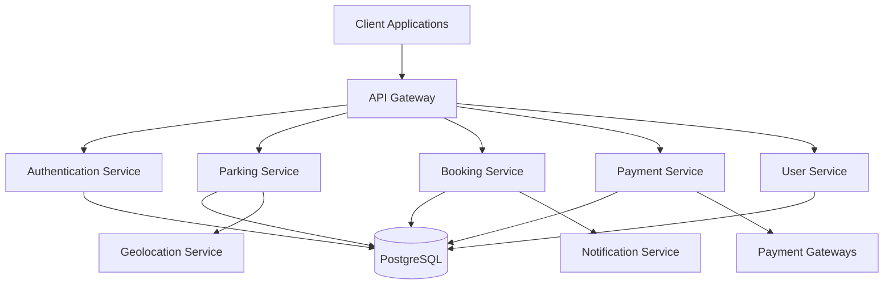
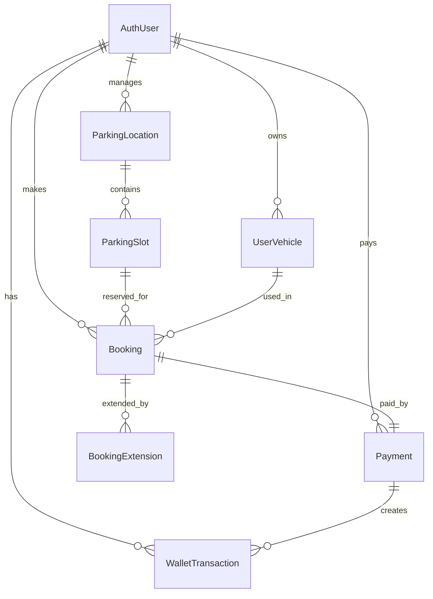
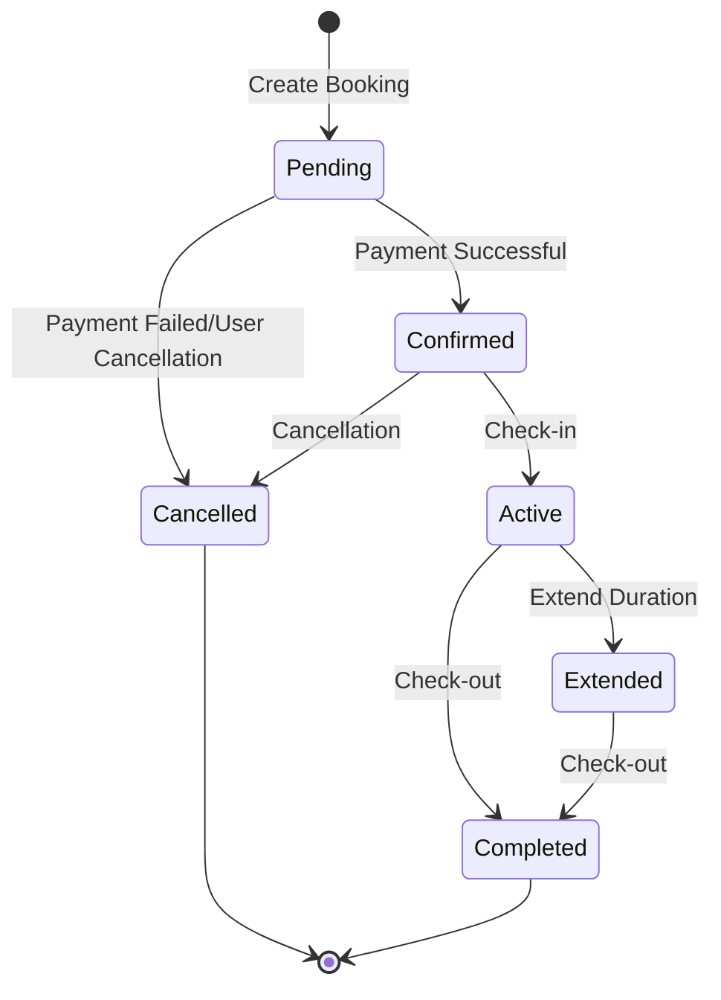

# 🅿️ Smart Parking Management System - Complete Documentation

<div align="center">

[](https://nestjs.com/)
[](https://www.typescriptlang.org/)
[](https://www.postgresql.org/)
[](https://www.docker.com/)
[](https://swagger.io/)


</div>

---

## 📋 Table of Contents

- [🎯 Overview](#-overview)
- [✨ Features](#-features)
- [🏗️ Architecture](#️-architecture)
- [🚀 Quick Start](#-quick-start)
- [📦 Installation](#-installation)
- [⚙️ Configuration](#️-configuration)
- [🔧 Development](#-development)
- [📊 Database Schema](#-database-schema)
- [🌐 API Documentation](#-api-documentation)
- [🔐 Authentication](#-authentication)
- [🅿️ Parking Management](#️-parking-management)
- [📅 Booking System](#-booking-system)
- [💳 Payment Processing](#-payment-processing)
- [🔍 Search & Filtering](#-search--filtering)
- [📱 Frontend Integration](#-frontend-integration)
- [🐳 Deployment](#-deployment)
- [🧪 Testing](#-testing)
- [📈 Monitoring](#-monitoring)
- [🛡️ Security](#️-security)
- [🤝 Contributing](#-contributing)
- [📝 License](#-license)

---

## 🎯 Overview

> **A comprehensive, enterprise-grade parking management system built with modern technologies and best practices.**

The Smart Parking Management System is a full-featured application designed to streamline parking operations for vendors, provide seamless booking experiences for customers, and offer robust administrative capabilities. Built with **NestJS**, **TypeScript**, and **PostgreSQL**, it follows microservices architecture principles and implements industry-standard security practices.

### 🌟 Key Highlights

- 🏗️ **Modular Architecture** - Clean, maintainable, and scalable codebase
- 🔐 **Enterprise Security** - JWT authentication, role-based access control
- 💳 **Multi-Gateway Payments** - Support for Stripe, Razorpay, PayPal, and more
- 📱 **API-First Design** - RESTful APIs with comprehensive Swagger documentation
- 🌐 **Real-time Features** - Live slot availability and booking updates
- 📊 **Advanced Analytics** - Comprehensive reporting and business intelligence

---

## ✨ Features

<details>
<summary><strong>🔐 Authentication & User Management</strong></summary>

- ✅ JWT-based authentication with refresh tokens
- ✅ Role-based access control (Admin, Vendor, Customer)
- ✅ Email verification and password reset
- ✅ User profile management
- ✅ Activity logging and audit trails

</details>

<details>
<summary><strong>🅿️ Parking Operations</strong></summary>

- ✅ Multi-location parking management
- ✅ Individual slot management with real-time status
- ✅ Dynamic pricing and custom rates
- ✅ Geolocation-based search
- ✅ Advanced filtering and sorting

</details>

<details>
<summary><strong>📅 Booking Management</strong></summary>

- ✅ Time-based reservation system
- ✅ QR code generation for digital passes
- ✅ Check-in/check-out functionality
- ✅ Booking extensions and modifications
- ✅ Cancellation with refund processing

</details>

<details>
<summary><strong>💳 Payment Processing</strong></summary>

- ✅ Multiple payment gateways integration
- ✅ Digital wallet system
- ✅ Automated refund processing
- ✅ Transaction history and receipts
- ✅ Webhook handling for real-time updates

</details>

<details>
<summary><strong>🚗 Vehicle Management</strong></summary>

- ✅ Multiple vehicle registration
- ✅ Vehicle validation and verification
- ✅ License plate management
- ✅ Vehicle type categorization

</details>

---

## 🏗️ Architecture



### 🧩 Module Structure

```
src/
├── 🔐 auth/                 # Authentication & Authorization
├── 👤 users/                # User Management
├── 🚗 vehicles/             # Vehicle Registration
├── 🅿️ parking/              # Parking Locations & Slots
├── 📅 bookings/             # Reservation Management
├── 💳 payments/             # Payment Processing
├── ⚙️ config/               # Configuration Files
├── 🛠️ common/               # Shared Utilities
└── 📊 database/             # Database Migrations
```

---

## 🚀 Quick Start

### Prerequisites

> **Ensure you have the following installed:**

- 📦 **Node.js** (v18.0.0 or higher)
- 🐘 **PostgreSQL** (v13.0 or higher)
- 🐳 **Docker** (optional, for containerized deployment)
- 📋 **npm** or **yarn** package manager

### 1️⃣ Clone Repository

```bash
git clone https://github.com/your-org/parking-management-system.git
cd parking-management-system/backend
```

### 2️⃣ Install Dependencies

```bash
npm install
# or
yarn install
```

### 3️⃣ Environment Setup

```bash
cp .env.example .env
# Edit .env with your configuration
```

### 4️⃣ Database Setup

```bash
# Start PostgreSQL with Docker Compose
docker-compose up -d postgres

# Run migrations
npm run migration:run

# Seed initial data
npm run seed
```

### 5️⃣ Start Development Server

```bash
npm run start:dev
```

🎉 **Server running at:** `http://localhost:3000`  
📖 **API Documentation:** `http://localhost:3000/api`

---

## 📦 Installation

### 🔧 Development Environment

<details>
<summary><strong>Step-by-step Installation Guide</strong></summary>

#### 1. System Requirements

| Component | Minimum Version | Recommended |
|-----------|----------------|-------------|
| Node.js | 18.0.0 | 20.0.0+ |
| PostgreSQL | 13.0 | 15.0+ |
| RAM | 4GB | 8GB+ |
| Storage | 10GB | 20GB+ |

#### 2. Database Configuration

```sql
-- Create database
CREATE DATABASE parking_management;

-- Create user
CREATE USER parking_user WITH PASSWORD 'your_password';

-- Grant privileges
GRANT ALL PRIVILEGES ON DATABASE parking_management TO parking_user;
```

#### 3. Environment Variables

```bash
# Database Configuration
DATABASE_HOST=localhost
DATABASE_PORT=5432
DATABASE_USERNAME=parking_user
DATABASE_PASSWORD=your_password
DATABASE_NAME=parking_management

# JWT Configuration
JWT_SECRET=your_super_secret_jwt_key
JWT_REFRESH_SECRET=your_refresh_secret_key
JWT_EXPIRATION=15m
JWT_REFRESH_EXPIRATION=7d

# Payment Gateway Configuration
STRIPE_SECRET_KEY=sk_test_...
STRIPE_WEBHOOK_SECRET=whsec_...
RAZORPAY_KEY_ID=rzp_test_...
RAZORPAY_KEY_SECRET=your_razorpay_secret

# Email Configuration
SMTP_HOST=smtp.gmail.com
SMTP_PORT=587
SMTP_USER=your_email@gmail.com
SMTP_PASS=your_app_password

# Application Configuration
PORT=3000
NODE_ENV=development
API_PREFIX=api
CORS_ORIGIN=http://localhost:3001
```

</details>

### 🐳 Docker Deployment

<details>
<summary><strong>Docker Configuration</strong></summary>

#### Docker Compose Setup

```yaml
version: '3.8'

services:
  app:
    build:
      context: .
      dockerfile: Dockerfile
    ports:
      - "3000:3000"
    environment:
      - NODE_ENV=production
    depends_on:
      - postgres
      - redis
    volumes:
      - ./uploads:/app/uploads

  postgres:
    image: postgres:15-alpine
    environment:
      POSTGRES_DB: parking_management
      POSTGRES_USER: parking_user
      POSTGRES_PASSWORD: secure_password
    ports:
      - "5432:5432"
    volumes:
      - postgres_data:/var/lib/postgresql/data

  redis:
    image: redis:7-alpine
    ports:
      - "6379:6379"
    volumes:
      - redis_data:/data

volumes:
  postgres_data:
  redis_data:
```

#### Dockerfile

```dockerfile
FROM node:18-alpine AS builder

WORKDIR /app
COPY package*.json ./
RUN npm ci --only=production

FROM node:18-alpine AS runner

WORKDIR /app
COPY --from=builder /app/node_modules ./node_modules
COPY . .

RUN npm run build

EXPOSE 3000

CMD ["npm", "run", "start:prod"]
```

</details>

---

## ⚙️ Configuration

### 🔧 Application Configuration

<details>
<summary><strong>Configuration Options</strong></summary>

#### Database Configuration

```typescript
// src/config/database.config.ts
export const databaseConfig = (configService: ConfigService): TypeOrmModuleOptions => ({
  type: 'postgres',
  host: configService.get('DATABASE_HOST'),
  port: configService.get('DATABASE_PORT'),
  username: configService.get('DATABASE_USERNAME'),
  password: configService.get('DATABASE_PASSWORD'),
  database: configService.get('DATABASE_NAME'),
  entities: [__dirname + '/../**/*.entity{.ts,.js}'],
  migrations: [__dirname + '/../migrations/*{.ts,.js}'],
  synchronize: configService.get('NODE_ENV') === 'development',
  logging: configService.get('NODE_ENV') === 'development',
  ssl: configService.get('NODE_ENV') === 'production' ? { rejectUnauthorized: false } : false,
});
```

#### JWT Configuration

```typescript
// src/config/jwt.config.ts
export const jwtConfig = (configService: ConfigService): JwtModuleOptions => ({
  secret: configService.get('JWT_SECRET'),
  signOptions: {
    expiresIn: configService.get('JWT_EXPIRATION', '15m'),
    issuer: 'parking-management-system',
    audience: 'parking-users',
  },
});
```

</details>

---

## 🔧 Development

### 📝 Available Scripts

| Script | Description | Usage |
|--------|-------------|-------|
| `start:dev` | Start development server with hot reload | `npm run start:dev` |
| `start:debug` | Start with debugging enabled | `npm run start:debug` |
| `start:prod` | Start production server | `npm run start:prod` |
| `build` | Build the application | `npm run build` |
| `test` | Run unit tests | `npm run test` |
| `test:e2e` | Run end-to-end tests | `npm run test:e2e` |
| `test:cov` | Run tests with coverage | `npm run test:cov` |
| `migration:create` | Create new migration | `npm run migration:create` |
| `migration:run` | Run pending migrations | `npm run migration:run` |
| `migration:revert` | Revert last migration | `npm run migration:revert` |
| `seed` | Seed database with initial data | `npm run seed` |
| `lint` | Run ESLint | `npm run lint` |
| `format` | Format code with Prettier | `npm run format` |

### 🔨 Development Workflow

<details>
<summary><strong>Best Practices</strong></summary>

#### Code Structure

```typescript
// Example module structure
src/modules/parking/
├── 📁 dto/
│   ├── create-parking-location.dto.ts
│   ├── update-parking-location.dto.ts
│   └── parking-response.dto.ts
├── 📁 entities/
│   ├── parking-location.entity.ts
│   └── parking-slot.entity.ts
├── 📁 guards/
│   └── parking-owner.guard.ts
├── 📁 interfaces/
│   └── parking.interface.ts
├── parking.controller.ts
├── parking.service.ts
└── parking.module.ts
```

#### Coding Standards

- 📏 **Line Length**: Maximum 120 characters
- 🎯 **Naming**: Use camelCase for variables, PascalCase for classes
- 📝 **Comments**: JSDoc for public methods and classes
- 🧪 **Testing**: Minimum 80% code coverage
- 🔍 **Linting**: ESLint with TypeScript rules

</details>

---

## 📊 Database Schema

### 🗄️ Entity Relationship Diagram



### 📋 Core Entities

<details>
<summary><strong>AuthUser Entity</strong></summary>

```typescript
@Entity('auth_users')
export class AuthUser {
  @PrimaryGeneratedColumn('uuid')
  id: string;

  @Column({ unique: true })
  email: string;

  @Column()
  password: string;

  @Column()
  firstName: string;

  @Column()
  lastName: string;

  @Column({
    type: 'enum',
    enum: UserRole,
    default: UserRole.CUSTOMER,
  })
  role: UserRole;

  @Column({ type: 'decimal', precision: 10, scale: 2, default: 0 })
  walletBalance: number;

  @Column({ default: false })
  isEmailVerified: boolean;

  @Column({ default: true })
  isActive: boolean;

  @CreateDateColumn()
  createdAt: Date;

  @UpdateDateColumn()
  updatedAt: Date;

  // Relations
  @OneToMany(() => UserVehicle, vehicle => vehicle.user)
  vehicles: UserVehicle[];

  @OneToMany(() => Booking, booking => booking.user)
  bookings: Booking[];

  @OneToMany(() => Payment, payment => payment.user)
  payments: Payment[];
}
```

</details>

<details>
<summary><strong>ParkingLocation Entity</strong></summary>

```typescript
@Entity('parking_locations')
export class ParkingLocation {
  @PrimaryGeneratedColumn('uuid')
  id: string;

  @Column()
  name: string;

  @Column('text')
  description: string;

  @Column()
  address: string;

  @Column()
  city: string;

  @Column('decimal', { precision: 10, scale: 8 })
  latitude: number;

  @Column('decimal', { precision: 11, scale: 8 })
  longitude: number;

  @Column({
    type: 'enum',
    enum: LocationType,
  })
  type: LocationType;

  @Column({ type: 'decimal', precision: 8, scale: 2 })
  hourlyRate: number;

  @Column({ type: 'int', default: 0 })
  totalSlots: number;

  @Column({ type: 'int', default: 0 })
  availableSlots: number;

  @Column({ type: 'decimal', precision: 3, scale: 2, default: 0 })
  rating: number;

  @Column({ default: true })
  isActive: boolean;

  // Relations
  @ManyToOne(() => AuthUser)
  @JoinColumn({ name: 'vendorId' })
  vendor: AuthUser;

  @OneToMany(() => ParkingSlot, slot => slot.location)
  slots: ParkingSlot[];
}
```

</details>

---

## 🌐 API Documentation

### 📋 Base URL

**Development:** `http://localhost:3000/api`  
**Production:** `https://your-domain.com/api`

### 🔐 Authentication Endpoints

<details>
<summary><strong>POST /auth/register</strong></summary>

Register a new user account.

**Request Body:**
```json
{
  "email": "user@example.com",
  "password": "SecurePass123!",
  "firstName": "John",
  "lastName": "Doe",
  "role": "customer"
}
```

**Response:**
```json
{
  "success": true,
  "data": {
    "user": {
      "id": "uuid",
      "email": "user@example.com",
      "firstName": "John",
      "lastName": "Doe",
      "role": "customer"
    },
    "tokens": {
      "accessToken": "jwt_token",
      "refreshToken": "refresh_token"
    }
  }
}
```

**Status Codes:**
- `201` - Created successfully
- `400` - Validation error
- `409` - Email already exists

</details>

<details>
<summary><strong>POST /auth/login</strong></summary>

Authenticate user and receive JWT tokens.

**Request Body:**
```json
{
  "email": "user@example.com",
  "password": "SecurePass123!"
}
```

**Response:**
```json
{
  "success": true,
  "data": {
    "user": {
      "id": "uuid",
      "email": "user@example.com",
      "firstName": "John",
      "lastName": "Doe",
      "role": "customer"
    },
    "tokens": {
      "accessToken": "jwt_token",
      "refreshToken": "refresh_token"
    }
  }
}
```

</details>

### 🅿️ Parking Management Endpoints

<details>
<summary><strong>GET /parking/locations</strong></summary>

Get parking locations with filtering and pagination.

**Query Parameters:**

| Parameter | Type | Description | Example |
|-----------|------|-------------|---------|
| `page` | number | Page number (default: 1) | `?page=2` |
| `limit` | number | Items per page (default: 10) | `?limit=20` |
| `search` | string | Search in name/address | `?search=downtown` |
| `city` | string | Filter by city | `?city=New York` |
| `type` | string | Filter by location type | `?type=garage` |
| `latitude` | number | User latitude for distance | `?latitude=40.7128` |
| `longitude` | number | User longitude for distance | `?longitude=-74.0060` |
| `radius` | number | Search radius in km | `?radius=5` |

**Example Request:**
```bash
GET /api/parking/locations?search=downtown&city=New%20York&page=1&limit=10
```

**Response:**
```json
{
  "success": true,
  "data": {
    "locations": [
      {
        "id": "uuid",
        "name": "Downtown Parking Garage",
        "description": "Secure underground parking",
        "address": "123 Main St, New York, NY",
        "city": "New York",
        "latitude": 40.7128,
        "longitude": -74.0060,
        "type": "garage",
        "hourlyRate": 15.00,
        "totalSlots": 100,
        "availableSlots": 25,
        "rating": 4.5,
        "vendor": {
          "id": "uuid",
          "firstName": "Jane",
          "lastName": "Smith"
        }
      }
    ],
    "total": 50,
    "totalPages": 5,
    "currentPage": 1
  }
}
```

</details>

### 📅 Booking Management Endpoints

<details>
<summary><strong>POST /bookings</strong></summary>

Create a new parking reservation.

**Request Headers:**
```
Authorization: Bearer {access_token}
Content-Type: application/json
```

**Request Body:**
```json
{
  "slotId": "uuid",
  "vehicleId": "uuid",
  "startTime": "2023-12-01T10:00:00Z",
  "endTime": "2023-12-01T14:00:00Z",
  "type": "regular",
  "licensePlate": "ABC123",
  "specialInstructions": "Compact car, needs easy access"
}
```

**Response:**
```json
{
  "success": true,
  "data": {
    "id": "uuid",
    "confirmationCode": "PARK123",
    "qrCode": "PARKING-1234567890-abc123",
    "status": "confirmed",
    "startTime": "2023-12-01T10:00:00Z",
    "endTime": "2023-12-01T14:00:00Z",
    "baseAmount": 60.00,
    "totalAmount": 60.00,
    "slot": {
      "id": "uuid",
      "slotNumber": "A-15",
      "type": "regular",
      "location": {
        "name": "Downtown Parking Garage",
        "address": "123 Main St"
      }
    },
    "vehicle": {
      "licensePlate": "ABC123",
      "make": "Toyota",
      "model": "Camry"
    }
  }
}
```

</details>

### 💳 Payment Processing Endpoints

<details>
<summary><strong>POST /payments</strong></summary>

Process payment for a booking.

**Request Body:**
```json
{
  "bookingId": "uuid",
  "amount": 60.00,
  "method": "credit_card",
  "gateway": "stripe",
  "gatewayTransactionId": "pi_3LE4Js2eZvKYlo2C0u1wxxxx"
}
```

**Response:**
```json
{
  "success": true,
  "data": {
    "id": "uuid",
    "amount": 60.00,
    "status": "completed",
    "method": "credit_card",
    "gateway": "stripe",
    "gatewayTransactionId": "pi_3LE4Js2eZvKYlo2C0u1wxxxx",
    "processedAt": "2023-12-01T09:30:00Z",
    "booking": {
      "id": "uuid",
      "confirmationCode": "PARK123"
    }
  }
}
```

</details>

---

## 🔐 Authentication

### 🎫 JWT Token Structure

<details>
<summary><strong>Access Token Payload</strong></summary>

```json
{
  "sub": "user_uuid",
  "email": "user@example.com",
  "role": "customer",
  "iat": 1701234567,
  "exp": 1701235467,
  "iss": "parking-management-system",
  "aud": "parking-users"
}
```

</details>

### 🛡️ Authorization Levels

| Role | Permissions | Endpoints Access |
|------|-------------|------------------|
| **Admin** | Full system access | All endpoints |
| **Vendor** | Manage own locations | Parking management, bookings view |
| **Customer** | Book parking, manage account | User endpoints, booking, payments |

### 🔒 Route Protection

```typescript
// Example: Vendor-only endpoint
@UseGuards(JwtAuthGuard, RolesGuard)
@Roles(UserRole.VENDOR, UserRole.ADMIN)
@Post('locations')
async createLocation(@Body() dto: CreateLocationDto) {
  // Implementation
}
```

---

## 🅿️ Parking Management

### 🏢 Location Management

<details>
<summary><strong>Location Types</strong></summary>

| Type | Description | Features |
|------|-------------|----------|
| **Street** | On-street parking | Meter parking, time limits |
| **Garage** | Multi-level parking | Covered, security cameras |
| **Lot** | Open parking lot | Large capacity, outdoor |
| **Private** | Private property | Restricted access |
| **Commercial** | Business parking | Validation required |

</details>

### 🚗 Slot Management

<details>
<summary><strong>Slot Types & Specifications</strong></summary>

```typescript
export enum SlotType {
  REGULAR = 'regular',        // Standard car slots
  COMPACT = 'compact',        // Smaller vehicles
  EV_CHARGING = 'ev_charging', // Electric vehicle charging
  DISABLED = 'disabled',      // Accessibility compliant
  VIP = 'vip',               // Premium slots
  MOTORCYCLE = 'motorcycle',  // Two-wheeler parking
  TRUCK = 'truck',           // Large vehicle slots
}

export enum SlotStatus {
  AVAILABLE = 'available',
  OCCUPIED = 'occupied',
  RESERVED = 'reserved',
  MAINTENANCE = 'maintenance',
  OUT_OF_ORDER = 'out_of_order',
}
```

</details>

### 📍 Geolocation Features

- **Radius Search**: Find parking within specified distance
- **Route Optimization**: Suggest closest available parking
- **Real-time Distance**: Calculate walking distance to destination
- **Map Integration**: Google Maps API integration

---

## 📅 Booking System

### 🔄 Booking Lifecycle



### ⏰ Booking Rules

<details>
<summary><strong>Business Rules</strong></summary>

- **Advance Booking**: Up to 30 days in advance
- **Minimum Duration**: 30 minutes
- **Maximum Duration**: 24 hours (single booking)
- **Grace Period**: 15 minutes after start time
- **Extension Limit**: 2 hours maximum
- **Cancellation**: Free up to 1 hour before start time

</details>

### 🎫 QR Code Integration

```typescript
// QR Code contains booking information
interface QRCodeData {
  bookingId: string;
  confirmationCode: string;
  slotNumber: string;
  validFrom: string;
  validUntil: string;
  checksum: string;
}
```

---

## 💳 Payment Processing

### 💰 Supported Payment Methods

<details>
<summary><strong>Payment Gateway Integration</strong></summary>

#### Stripe Integration
```typescript
// Stripe payment processing
async processStripePayment(paymentDto: CreatePaymentDto) {
  const paymentIntent = await this.stripe.paymentIntents.create({
    amount: paymentDto.amount * 100, // Convert to cents
    currency: 'usd',
    payment_method: paymentDto.paymentMethodId,
    confirmation_method: 'manual',
    confirm: true,
  });
  
  return paymentIntent;
}
```

#### Razorpay Integration
```typescript
// Razorpay payment processing
async processRazorpayPayment(paymentDto: CreatePaymentDto) {
  const order = await this.razorpay.orders.create({
    amount: paymentDto.amount * 100,
    currency: 'INR',
    receipt: `receipt_${Date.now()}`,
  });
  
  return order;
}
```

</details>

### 🔄 Refund Processing

| Refund Type | Timeline | Processing Fee |
|-------------|----------|----------------|
| **Instant** | Immediate (Wallet) | Free |
| **Standard** | 3-5 business days | 2.9% + $0.30 |
| **Expedited** | Same day | 4.9% + $0.50 |

### 💼 Wallet System

<details>
<summary><strong>Wallet Features</strong></summary>

- **Auto Top-up**: Automatic wallet refill when balance is low
- **Transaction History**: Complete audit trail
- **Transfer Limits**: Daily/monthly transaction limits
- **Security**: Two-factor authentication for large transactions
- **Cashback**: Loyalty rewards program

</details>

---

## 🔍 Search & Filtering

### 🎯 Advanced Search Features

<details>
<summary><strong>Search Capabilities</strong></summary>

#### Text Search
- **Location Name**: Fuzzy matching on parking facility names
- **Address Search**: Full address or partial address matching
- **Landmark Search**: Search by nearby landmarks or points of interest

#### Geolocation Search
- **Current Location**: Find parking near user's current position
- **Destination-based**: Find parking near a specific destination
- **Route-based**: Find parking along a travel route

#### Availability Search
- **Time-based**: Find available slots for specific time periods
- **Duration-based**: Search by required parking duration
- **Real-time**: Live availability checking

</details>

### 🎛️ Filtering Options

| Filter Category | Options | Description |
|----------------|---------|-------------|
| **Price Range** | $5-10, $10-20, $20+ | Filter by hourly rate |
| **Distance** | <0.5mi, 0.5-1mi, 1-2mi | Distance from location |
| **Amenities** | EV Charging, Covered, Security | Special features |
| **Accessibility** | Disabled access, Wide slots | Accessibility features |
| **Vehicle Type** | Car, Motorcycle, Truck | Vehicle compatibility |

### 📊 Sorting Options

- **Distance** (Nearest first)
- **Price** (Lowest first)
- **Rating** (Highest first)
- **Availability** (Most available first)
- **Recently Added** (Newest first)

---

## 📱 Frontend Integration

### 🔌 API Client Examples

<details>
<summary><strong>JavaScript/TypeScript Client</strong></summary>

```typescript
// API Client configuration
class ParkingApiClient {
  private baseURL = 'http://localhost:3000/api';
  private accessToken: string;

  constructor(accessToken: string) {
    this.accessToken = accessToken;
  }

  private async request<T>(endpoint: string, options: RequestInit = {}): Promise<T> {
    const response = await fetch(`${this.baseURL}${endpoint}`, {
      ...options,
      headers: {
        'Content-Type': 'application/json',
        'Authorization': `Bearer ${this.accessToken}`,
        ...options.headers,
      },
    });

    if (!response.ok) {
      throw new Error(`API request failed: ${response.statusText}`);
    }

    return response.json();
  }

  // Authentication
  async login(email: string, password: string) {
    return this.request('/auth/login', {
      method: 'POST',
      body: JSON.stringify({ email, password }),
    });
  }

  // Parking locations
  async getLocations(params: LocationSearchParams) {
    const queryString = new URLSearchParams(params).toString();
    return this.request(`/parking/locations?${queryString}`);
  }

  // Create booking
  async createBooking(booking: CreateBookingDto) {
    return this.request('/bookings', {
      method: 'POST',
      body: JSON.stringify(booking),
    });
  }
}
```

</details>

<details>
<summary><strong>React Hook Example</strong></summary>

```typescript
// Custom React hook for parking locations
import { useState, useEffect } from 'react';

interface UseLocationsParams {
  search?: string;
  city?: string;
  latitude?: number;
  longitude?: number;
  radius?: number;
}

export const useLocations = (params: UseLocationsParams) => {
  const [locations, setLocations] = useState([]);
  const [loading, setLoading] = useState(false);
  const [error, setError] = useState(null);

  useEffect(() => {
    const fetchLocations = async () => {
      setLoading(true);
      try {
        const response = await apiClient.getLocations(params);
        setLocations(response.data.locations);
      } catch (err) {
        setError(err.message);
      } finally {
        setLoading(false);
      }
    };

    fetchLocations();
  }, [params]);

  return { locations, loading, error };
};
```

</details>

### 📲 Mobile Integration

<details>
<summary><strong>React Native Example</strong></summary>

```typescript
// React Native geolocation integration
import Geolocation from '@react-native-geolocation-service/geolocation';

export const useNearbyParking = () => {
  const [location, setLocation] = useState(null);
  const [nearbyParking, setNearbyParking] = useState([]);

  useEffect(() => {
    Geolocation.getCurrentPosition(
      (position) => {
        const { latitude, longitude } = position.coords;
        setLocation({ latitude, longitude });
        
        // Fetch nearby parking
        apiClient.getLocations({
          latitude,
          longitude,
          radius: 2, // 2km radius
        }).then(response => {
          setNearbyParking(response.data.locations);
        });
      },
      (error) => {
        console.error('Location error:', error);
      },
      { enableHighAccuracy: true, timeout: 15000, maximumAge: 10000 }
    );
  }, []);

  return { location, nearbyParking };
};
```

</details>

---

## 🐳 Deployment

### ☁️ Cloud Deployment Options

<details>
<summary><strong>AWS Deployment</strong></summary>

#### ECS Deployment
```yaml
# docker-compose.prod.yml
version: '3.8'

services:
  app:
    image: your-registry/parking-app:latest
    environment:
      - NODE_ENV=production
      - DATABASE_URL=${DATABASE_URL}
      - JWT_SECRET=${JWT_SECRET}
    deploy:
      replicas: 3
      resources:
        limits:
          cpus: '1'
          memory: 1G
        reservations:
          cpus: '0.5'
          memory: 512M
```

#### RDS Configuration
```sql
-- Production database setup
CREATE DATABASE parking_management_prod;
CREATE USER parking_prod WITH PASSWORD 'secure_production_password';
GRANT ALL PRIVILEGES ON DATABASE parking_management_prod TO parking_prod;
```

</details>

<details>
<summary><strong>Kubernetes Deployment</strong></summary>

```yaml
# k8s/deployment.yaml
apiVersion: apps/v1
kind: Deployment
metadata:
  name: parking-api
spec:
  replicas: 3
  selector:
    matchLabels:
      app: parking-api
  template:
    metadata:
      labels:
        app: parking-api
    spec:
      containers:
      - name: parking-api
        image: parking-app:latest
        ports:
        - containerPort: 3000
        env:
        - name: DATABASE_URL
          valueFrom:
            secretKeyRef:
              name: parking-secrets
              key: database-url
        - name: JWT_SECRET
          valueFrom:
            secretKeyRef:
              name: parking-secrets
              key: jwt-secret
---
apiVersion: v1
kind: Service
metadata:
  name: parking-api-service
spec:
  selector:
    app: parking-api
  ports:
    - protocol: TCP
      port: 80
      targetPort: 3000
  type: LoadBalancer
```

</details>

### 🔧 Environment-Specific Configurations

| Environment | Database | Cache | Monitoring |
|-------------|----------|-------|------------|
| **Development** | Local PostgreSQL | Memory | Console logs |
| **Staging** | AWS RDS | Redis | CloudWatch |
| **Production** | AWS RDS (Multi-AZ) | Redis Cluster | Full monitoring |

---

## 🧪 Testing

### 🎯 Test Coverage Requirements

- **Unit Tests**: Minimum 80% coverage
- **Integration Tests**: All API endpoints
- **E2E Tests**: Critical user journeys
- **Performance Tests**: Load testing for peak usage

### 🔬 Testing Examples

<details>
<summary><strong>Unit Test Example</strong></summary>

```typescript
// parking.service.spec.ts
import { Test, TestingModule } from '@nestjs/testing';
import { ParkingService } from './parking.service';
import { getRepositoryToken } from '@nestjs/typeorm';
import { ParkingLocation } from './entities/parking-location.entity';

describe('ParkingService', () => {
  let service: ParkingService;
  let locationRepository: Repository<ParkingLocation>;

  beforeEach(async () => {
    const module: TestingModule = await Test.createTestingModule({
      providers: [
        ParkingService,
        {
          provide: getRepositoryToken(ParkingLocation),
          useValue: mockRepository,
        },
      ],
    }).compile();

    service = module.get<ParkingService>(ParkingService);
    locationRepository = module.get<Repository<ParkingLocation>>(
      getRepositoryToken(ParkingLocation),
    );
  });

  describe('findAllLocations', () => {
    it('should return paginated locations', async () => {
      const mockLocations = [
        { id: '1', name: 'Test Location', city: 'Test City' },
      ];
      
      jest.spyOn(locationRepository, 'createQueryBuilder').mockReturnValue({
        where: jest.fn().mockReturnThis(),
        orderBy: jest.fn().mockReturnThis(),
        skip: jest.fn().mockReturnThis(),
        take: jest.fn().mockReturnThis(),
        getManyAndCount: jest.fn().mockResolvedValue([mockLocations, 1]),
      } as any);

      const result = await service.findAllLocations(1, 10);
      
      expect(result.locations).toEqual(mockLocations);
      expect(result.total).toBe(1);
      expect(result.totalPages).toBe(1);
    });
  });
});
```

</details>

<details>
<summary><strong>E2E Test Example</strong></summary>

```typescript
// booking.e2e-spec.ts
import { Test, TestingModule } from '@nestjs/testing';
import { INestApplication } from '@nestjs/common';
import * as request from 'supertest';
import { AppModule } from '../src/app.module';

describe('Booking (e2e)', () => {
  let app: INestApplication;
  let accessToken: string;

  beforeAll(async () => {
    const moduleFixture: TestingModule = await Test.createTestingModule({
      imports: [AppModule],
    }).compile();

    app = moduleFixture.createNestApplication();
    await app.init();

    // Login and get access token
    const loginResponse = await request(app.getHttpServer())
      .post('/auth/login')
      .send({
        email: 'test@example.com',
        password: 'password123',
      })
      .expect(200);

    accessToken = loginResponse.body.data.tokens.accessToken;
  });

  it('/bookings (POST) should create a new booking', () => {
    return request(app.getHttpServer())
      .post('/bookings')
      .set('Authorization', `Bearer ${accessToken}`)
      .send({
        slotId: 'test-slot-id',
        startTime: '2023-12-01T10:00:00Z',
        endTime: '2023-12-01T14:00:00Z',
        type: 'regular',
      })
      .expect(201)
      .expect((res) => {
        expect(res.body.success).toBe(true);
        expect(res.body.data.confirmationCode).toBeDefined();
      });
  });

  afterAll(async () => {
    await app.close();
  });
});
```

</details>

---

## 📈 Monitoring

### 📊 Key Metrics

<details>
<summary><strong>Application Metrics</strong></summary>

#### Performance Metrics
- **Response Time**: API endpoint response times
- **Throughput**: Requests per second
- **Error Rate**: 4xx/5xx error percentage
- **Database Performance**: Query execution time

#### Business Metrics
- **Booking Rate**: Bookings per hour/day
- **Revenue**: Payment processing volume
- **User Engagement**: Active users, session duration
- **Conversion Rate**: Search to booking conversion

</details>

### 🚨 Alerting Rules

| Metric | Threshold | Action |
|--------|-----------|--------|
| Response Time | >2 seconds | Warning |
| Error Rate | >5% | Critical |
| Database CPU | >80% | Warning |
| Available Slots | <10% | Notification |

### 📈 Dashboard Configuration

<details>
<summary><strong>Grafana Dashboard JSON</strong></summary>

```json
{
  "dashboard": {
    "title": "Parking Management System",
    "panels": [
      {
        "title": "API Response Time",
        "type": "graph",
        "targets": [
          {
            "expr": "histogram_quantile(0.95, rate(http_request_duration_seconds_bucket[5m]))",
            "legendFormat": "95th percentile"
          }
        ]
      },
      {
        "title": "Active Bookings",
        "type": "stat",
        "targets": [
          {
            "expr": "sum(parking_active_bookings)",
            "legendFormat": "Active Bookings"
          }
        ]
      }
    ]
  }
}
```

</details>

---

## 🛡️ Security

### 🔒 Security Measures

<details>
<summary><strong>Authentication Security</strong></summary>

#### JWT Security
- **Short-lived Access Tokens**: 15-minute expiration
- **Refresh Token Rotation**: New refresh token on each use
- **Token Blacklisting**: Revoke compromised tokens
- **Audience/Issuer Validation**: Prevent token misuse

#### Password Security
- **Bcrypt Hashing**: Industry-standard password hashing
- **Password Complexity**: Minimum 8 characters, mixed case, numbers, symbols
- **Account Lockout**: Temporary lockout after failed attempts
- **Password History**: Prevent reuse of recent passwords

</details>

<details>
<summary><strong>API Security</strong></summary>

#### Rate Limiting
```typescript
// Rate limiting configuration
@Injectable()
export class CustomRateLimitGuard implements CanActivate {
  private readonly limits = new Map();

  canActivate(context: ExecutionContext): boolean {
    const request = context.switchToHttp().getRequest();
    const key = `${request.ip}:${request.route.path}`;
    
    const limit = this.limits.get(key) || { count: 0, resetTime: Date.now() + 60000 };
    
    if (Date.now() > limit.resetTime) {
      limit.count = 0;
      limit.resetTime = Date.now() + 60000;
    }
    
    if (limit.count >= 100) { // 100 requests per minute
      throw new ThrottlerException();
    }
    
    limit.count++;
    this.limits.set(key, limit);
    
    return true;
  }
}
```

#### Input Validation
- **DTO Validation**: Comprehensive input validation using class-validator
- **SQL Injection Prevention**: Parameterized queries with TypeORM
- **XSS Protection**: Input sanitization and output encoding
- **CORS Configuration**: Restricted cross-origin requests

</details>

### 🔐 Data Protection

- **Encryption at Rest**: Database encryption
- **Encryption in Transit**: TLS 1.3 for all communications
- **PII Protection**: Personal data anonymization
- **GDPR Compliance**: Data deletion and export capabilities

---

## 🤝 Contributing

### 📋 Development Guidelines

<details>
<summary><strong>Code Contribution Process</strong></summary>

#### 1. Fork and Clone
```bash
git clone https://github.com/your-username/parking-management-system.git
cd parking-management-system
git remote add upstream https://github.com/original-org/parking-management-system.git
```

#### 2. Create Feature Branch
```bash
git checkout -b feature/your-feature-name
```

#### 3. Development Setup
```bash
npm install
cp .env.example .env
npm run migration:run
npm run seed
```

#### 4. Code Standards
- Follow TypeScript best practices
- Write unit tests for new features
- Update documentation for API changes
- Follow conventional commit messages

#### 5. Commit and Push
```bash
git add .
git commit -m "feat: add new parking location validation"
git push origin feature/your-feature-name
```

#### 6. Create Pull Request
- Describe changes thoroughly
- Include test coverage report
- Request review from maintainers

</details>

### 📝 Commit Message Convention

```
<type>[optional scope]: <description>

[optional body]

[optional footer(s)]
```

**Types:**
- `feat`: New feature
- `fix`: Bug fix
- `docs`: Documentation changes
- `style`: Code style changes
- `refactor`: Code refactoring
- `test`: Test additions/modifications
- `chore`: Maintenance tasks

### 🐛 Bug Reports

**Please include:**
- Environment details (OS, Node.js version, etc.)
- Steps to reproduce
- Expected vs actual behavior
- Error logs and stack traces
- Screenshots (if applicable)

---

## 📝 License

### MIT License

```
Copyright (c) 2023 Parking Management System

Permission is hereby granted, free of charge, to any person obtaining a copy
of this software and associated documentation files (the "Software"), to deal
in the Software without restriction, including without limitation the rights
to use, copy, modify, merge, publish, distribute, sublicense, and/or sell
copies of the Software, and to permit persons to whom the Software is
furnished to do so, subject to the following conditions:

The above copyright notice and this permission notice shall be included in all
copies or substantial portions of the Software.

THE SOFTWARE IS PROVIDED "AS IS", WITHOUT WARRANTY OF ANY KIND, EXPRESS OR
IMPLIED, INCLUDING BUT NOT LIMITED TO THE WARRANTIES OF MERCHANTABILITY,
FITNESS FOR A PARTICULAR PURPOSE AND NONINFRINGEMENT. IN NO EVENT SHALL THE
AUTHORS OR COPYRIGHT HOLDERS BE LIABLE FOR ANY CLAIM, DAMAGES OR OTHER
LIABILITY, WHETHER IN AN ACTION OF CONTRACT, TORT OR OTHERWISE, ARISING FROM,
OUT OF OR IN CONNECTION WITH THE SOFTWARE OR THE USE OR OTHER DEALINGS IN THE
SOFTWARE.
```

---

## 📞 Support

### 🆘 Getting Help

| Contact Method | Response Time | Availability |
|----------------|---------------|--------------|
| 📧 **Email** | 24-48 hours | support@parking-system.com |
| 💬 **Discord** | Real-time | [Join our Discord](https://discord.gg/parking-system) |
| 📋 **GitHub Issues** | 2-5 days | [Report Issues](https://github.com/org/parking-system/issues) |
| 📖 **Documentation** | Instant | [Wiki](https://github.com/org/parking-system/wiki) |

### 🔧 Troubleshooting

<details>
<summary><strong>Common Issues</strong></summary>

#### Database Connection Issues
```bash
# Check database status
docker-compose ps postgres

# View database logs
docker-compose logs postgres

# Reset database
npm run migration:revert
npm run migration:run
```

#### Authentication Problems
```bash
# Verify JWT secret is set
echo $JWT_SECRET

# Check token expiration
npm run token:verify

# Clear token cache
npm run cache:clear
```

#### Payment Gateway Issues
```bash
# Test webhook endpoints
npm run test:webhooks

# Verify API keys
npm run config:verify

# Check gateway status
npm run gateways:status
```

</details>

---

<div align="center">

### 🚀 Ready to Get Started?

[📦 Quick Installation](#-installation) | [🌐 API Documentation](#-api-documentation) | [🤝 Contributing](#-contributing)

---

**Made with ❤️ by the Parking Management Team**

⭐ **Star this repository if you found it helpful!**

</div>

---

*Last updated: December 2023*
